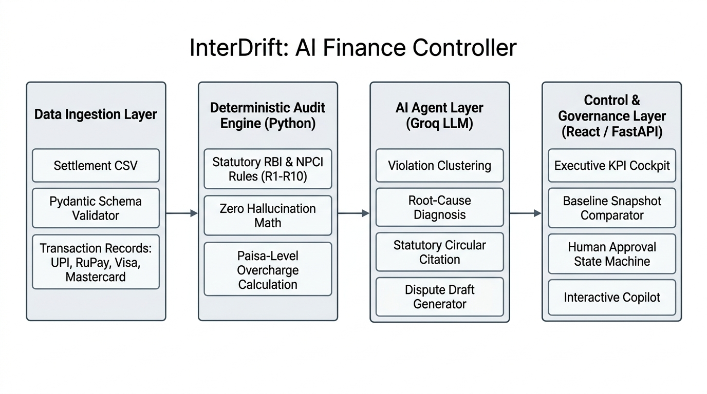
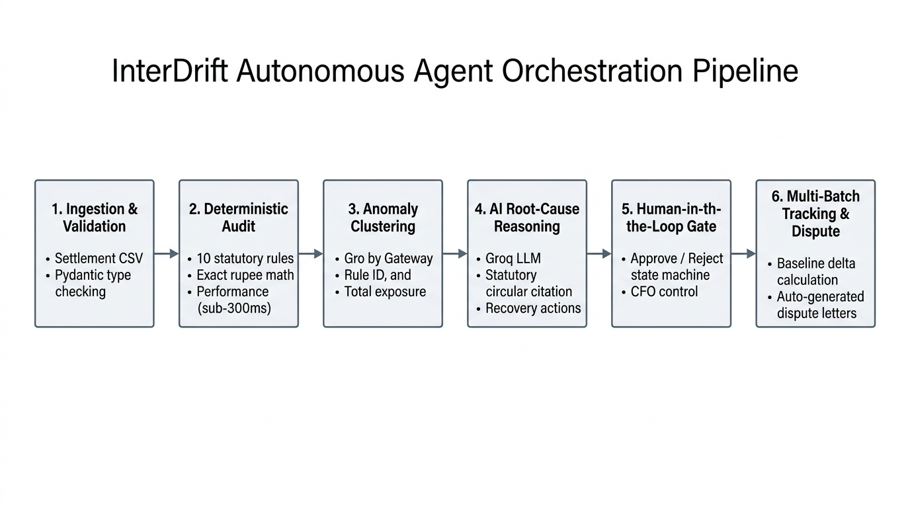

# InterDrift: Autonomous AI Finance Controller

Autonomous payment fee auditing, statutory compliance verification, and revenue leakage remediation for Indian merchants and enterprise payment operations.

---

## 1. Problem Track and Problem Statement

### Track: Track 04 - AI Finance Controller (Razorpay AI Buildathon)

### Problem Statement
Online merchants processing payments via Indian payment aggregators and payment gateways (PGs) face systematic, silent margin leakage known as **Interchange Drift**. 

When transactions scale into thousands or millions of payments daily, merchant statements are burdened by billing discrepancies:
- **Statutory Non-Compliance:** Gateways failing to apply statutory 0% MDR on domestic RuPay debit cards and bank UPI, or exceeding regulatory fee ceilings established by the Reserve Bank of India (RBI) and the National Payments Corporation of India (NPCI).
- **Commercial Surcharge Downgrades:** Corporate cards downgraded to higher cost-of-acceptance tiers due to missing Level 2/Level 3 data (e.g., missing tax or purchase order attributes).
- **Pricing Model Arbitrage:** Hidden margin spreads between flat blended merchant discount rates (MDR) and actual underlying interchange costs.

Financial operations teams currently rely on manual spreadsheet sampling, leaving over 95% of transactions unverified and leaking millions of rupees annually. Existing LLM-based solutions fail in production because generative models hallucinate numeric math, leading to false dispute claims.

---

## 2. Solution Overview

**InterDrift** is an enterprise-grade AI Finance Controller engineered specifically for Indian payment rails. 

It solves the verification bottleneck through a **Deterministic-Agentic Hybrid Architecture**:
- **Deterministic Mathematical Core:** A 100% code-based, zero-hallucination rules engine in Python that evaluates statutory regulations and contractual fee schedules down to the paisa.
- **Agentic Reasoning Layer:** An autonomous Groq LLM layer (`qwen/qwen3.8-27b`) that ingests mathematically verified violations, clusters systemic gateway failures, diagnoses root causes with exact regulatory circular citations, and drafts formal dispute recovery letters.
- **Human-in-the-Loop Governance:** An executive control cockpit that enforces strict state-machine controls (`Open`, `Investigating`, `Action Ready`, `Awaiting Human Approval`, `Improved`, `Closed`), requiring explicit finance manager authorization before filing dispute actions.
- **Verifiable Multi-Batch Tracking:** A baseline snapshot comparator that mathematically proves whether gateway dispute interventions reduced fee leakage over successive billing cycles.

---

## 3. Technology Stack and Regulatory Resources

### Technology Stack
- **Backend & Mathematical Engine:**
  - Python 3.10+
  - FastAPI (High-concurrency asynchronous REST API framework)
  - Uvicorn (Lightning-fast ASGI web server implementation)
  - Pydantic v2 (Strict type enforcement, runtime validation, and schema definitions)
  - Pandas & NumPy (Vectorized tabular transaction analysis and numerical computations)
  - Python-Multipart (Streaming multi-part settlement file upload handling)
  - Faker (Synthetic financial dataset generation with realistic edge cases)
- **AI Agent & LLM Orchestration:**
  - Groq Cloud API with `qwen/qwen3.8-27b` (High-throughput, sub-second reasoning and diagnosis)
  - Google Gemini API with `gemini-2.5-flash` (Resilient secondary fallback inference router)
  - HTTPX & Tenacity (Asynchronous HTTP client with retry backoff protocols)
- **Frontend & User Interface:**
  - React 19 (Component-driven user interface architecture)
  - Vite 8 (Next-generation frontend tooling and rapid HMR bundling)
  - TailwindCSS v4 (Utility-first styling with native dark mode support)
  - Lucide React (Clean, consistent financial and operational iconography)
  - Radix UI Primitives (`@radix-ui/react-slot`) & Tailwind Merge (Accessible, collision-free UI components)

### Regulatory Standards & Legal Sources
- **Reserve Bank of India (RBI):** Circular `RBI/2017-18/105 DPSS.CO.PD No.1633/02.14.003/2017-18` (Rationalisation of Merchant Discount Rate for debit card transactions across turnover tiers).
- **National Payments Corporation of India (NPCI):** Circular `NPCI/UPI/OC-154/2022-23` (Operational guidelines for linking RuPay Credit Cards to Unified Payments Interface).
- **National Payments Corporation of India (NPCI):** Circular `NPCI/2022-23/PPI-Interchange` (Interchange fee framework on Prepaid Payment Instruments used through UPI).
- **Ministry of Finance (Government of India):** Section 10A of the Payment and Settlement Systems Act, 2007 (Statutory zero-MDR mandate for prescribed electronic payment modes).
- **ISO 18245 Standards:** Retail financial services merchant category codes (MCC identification for fee slab alignment).

---

## 4. Core Features and Audit Rules

### System Features
- **Deterministic Sub-300ms Verification:** Processes and audits high-volume settlement batches against statutory and commercial rules in sub-second runtimes.
- **Honest Exception Handling:** Transparently isolates records with missing or ambiguous metadata into an unclassified exceptions queue for human review, eliminating speculative guessing.
- **Automated Dispute Drafting:** Generates legal recovery claims pre-filled with transaction IDs, violated circular citations, and exact rupee refund values.
- **Multi-Batch Baseline Comparison:** Locks baseline metrics (Batch 1) and computes comparative deltas against subsequent runs (Batch 2) to demonstrate measurable fee reduction.
- **Interactive Audit Copilot:** A persistent conversational assistant grounded in live audit state, answering natural language questions regarding root causes, rules, and exposures.

### Audit Rule Index (10 Evaluated Rules)

| Rule ID | Category | Statutory / Contract Benchmark | Expected Fee Policy | Confidence |
|:---|:---|:---|:---|:---|
| **R1** | Bank UPI | Finance Act 2019 / Sec 10A PSS Act 2007 | 0.00% Zero-MDR | Legally Sourced |
| **R2** | RuPay Debit | Ministry of Finance Gazette / Sec 10A PSS Act | 0.00% Zero-MDR | Legally Sourced |
| **R3** | RuPay Credit UPI (<= Rs 2,000) | NPCI Circular NPCI/UPI/OC-154/2022-23 | 0.00% Zero-MDR | Legally Sourced |
| **R4** | RuPay Credit UPI (> Rs 2,000) | NPCI Framework / Tiered Interchange | 1.50% Base Tier | Model Benchmark |
| **R5** | PPI Wallet UPI (<= Rs 2,000) | NPCI Circular NPCI/2022-23/PPI-Interchange | 0.00% Zero-MDR | Legally Sourced |
| **R6b** | PPI Wallet UPI (> Rs 2,000) | NPCI Circular NPCI/2022-23/PPI-Interchange (Retail) | Capped at 0.90% | Legally Sourced |
| **R7** | Non-RuPay Debit (<= Rs 20L) | RBI Circular RBI/2017-18/105 | Capped at 0.40% (Max Rs 200) | Legally Sourced |
| **R8** | Non-RuPay Debit (> Rs 20L) | RBI Circular RBI/2017-18/105 | Capped at 0.90% (Max Rs 1,000) | Legally Sourced |
| **R10** | Commercial L2/L3 Downgrade | B2B Commercial Card Acceptance Standard | 80 bps Penalty on Missing Data | Model Benchmark |
| **R11** | Blended vs IC+ Spread | Enterprise Cost-of-Acceptance Disparity | Excess Margin over True Interchange | Model Benchmark |

---

## 5. System Architecture and Workflow

InterDrift enforces strict separation between mathematical calculation and qualitative reasoning.



### Architecture Workflow
1. **Data Ingestion Layer:** Accepts merchant settlement CSV files. Ingested records undergo Pydantic schema validation to verify transaction amounts, declared payment rails (UPI, RuPay, Visa, Mastercard, Netbanking), and gateway fee line items.
2. **Deterministic Audit Engine (Layer 1):** Python-based evaluation executes all 10 statutory and contract rules against the dataset. It calculates the exact expected statutory fee, flags violations, and computes the net overcharge delta in INR.
3. **AI Agent Reasoning Layer (Layer 2):** Ingests row-level violations, groups them into root-cause clusters by payment gateway and rule type, and synthesizes structured investigation cases using high-throughput Groq LLM inference.
4. **Governance & Presentation Layer (Layer 3):** A React/Vite cockpit backed by FastAPI endpoints provides real-time telemetry, baseline delta tracking, human authorization gates, and audit trail ledger views.

---

## 6. Agent Orchestration Workflow and Architecture

The autonomous agent is designed to execute as a supervised workflow orchestrator rather than an unchecked automated actor.



### Orchestration Pipeline
1. **Ingestion & Validation:** Parses and validates batch data against defined Pydantic transaction models.
2. **Deterministic Audit:** Computes fee variance across statutory caps and commercial benchmarks with sub-300ms latency.
3. **Anomaly Clustering:** Aggregates isolated transaction violations into grouped failure categories (e.g., all RuPay debit transactions overcharged by Gateway A).
4. **AI Root-Cause Reasoning:** The Groq-powered reasoning module analyzes the violation patterns, maps them to official regulatory circulars, and synthesizes an executive case file.
5. **Human-in-the-Loop Governance:** Cases are queued under `Awaiting Human Approval`. Finance controllers evaluate findings, view underlying transaction evidence, and execute explicit `Approve` or `Reject` actions.
6. **Multi-Batch Tracking & Dispute Export:** Automatically computes baseline deltas to verify recovery trends, and formats formal dispute recovery documentation for gateway submission.

---

## 7. Key Technical Distinctions and Reliability Guarantees

### Zero-Hallucination Guarantee
Financial reconciliation demands absolute mathematical reproducibility. InterDrift guarantees zero numeric hallucination by restricting LLM operations strictly to narrative diagnosis, root-cause classification, and correspondence generation. All monetary amounts, fee deltas, match rates, and exposure sums are computed deterministically.

### Honest Handling of Exceptions
Real-world payment feeds frequently contain missing routing tags or ambiguous MCC codes. Rather than forcing probabilistic guesses, InterDrift categorizes such items under an `Exceptions` status with clear audit notes, satisfying enterprise compliance requirements for audit transparency.

### Sub-300ms Pre-Warmed Performance
To ensure seamless operator workflows and instant demo evaluation, InterDrift supports a pre-warmed caching protocol (`warm_cache.py`). Common benchmark scenarios load deterministically in less than 300 milliseconds without being impacted by external API network jitter.

---

## 8. Project Setup and Installation

### Prerequisites
- **Python:** Version 3.10 or higher
- **Node.js:** Version 18.0 or higher
- **Package Manager:** `npm` or `yarn`
- **Groq API Key:** For LLM root-cause reasoning and AI Copilot

### Environment Configuration
Create a `.env` file in the project root directory:
```env
GROQ_API_KEY=your_groq_api_key_here
GROQ_MODEL=qwen/qwen3.8-27b
FALLBACK_TO_MOCK=false
PORT=8000
```

### Installation Steps

#### 1. Backend Setup
```bash
# Clone the repository
git clone https://github.com/xsopunk/interdrift.git
cd interdrift

# Create and activate a Python virtual environment
python -m venv venv
# On Windows:
venv\Scripts\activate
# On Linux/macOS:
source venv/bin/activate

# Install backend dependencies
pip install -r requirements.txt
```

#### 2. Pre-Warm Audit and Reasoning Cache
Pre-compute benchmark evaluations to ensure sub-300ms UI responsiveness:
```bash
python warm_cache.py
```

#### 3. Frontend Setup
```bash
# Navigate to frontend directory
cd frontend

# Install dependencies
npm install

# Return to root directory
cd ..
```

---

## 9. Running the Application

### Start Services

#### Terminal 1: Backend API (FastAPI)
```bash
uvicorn src.api.main:app --reload --port 8000
```
The API will be available at `http://127.0.0.1:8000`. Interactive OpenAPI documentation is accessible at `http://127.0.0.1:8000/docs`.

#### Terminal 2: Frontend Dashboard (React + Vite)
```bash
cd frontend
npm run dev
```
The user interface will launch at `http://localhost:5173`.

---

## 10. API Reference

| Endpoint | Method | Description |
|:---|:---|:---|
| `/api/report` | `GET` | Fetches aggregated executive overview, leakage categories, and offenders |
| `/api/audit-trail` | `GET` | Retrieves row-level audit verification logs for all ingested transactions |
| `/api/upload` | `POST` | Ingests a new settlement CSV file and runs deterministic audit rules |
| `/api/agent/cases` | `GET` | Returns prioritized agent investigation cases and exposure metrics |
| `/api/agent/cases/{id}/approve` | `POST` | Human-in-the-loop gate: Approves an investigation remediation case |
| `/api/agent/cases/{id}/reject` | `POST` | Human-in-the-loop gate: Rejects an investigation remediation case |
| `/api/control-effectiveness` | `GET` | Computes comparative metrics and verdict against locked baseline snapshot |
| `/api/baseline/snapshot` | `POST` | Locks the current audit batch results as the active baseline benchmark |
| `/api/rules` | `GET` | Returns structured definitions and legal citations for all 10 audit rules |
| `/api/copilot/chat` | `POST` | Context-aware AI Copilot query endpoint grounded in live audit telemetry |

---

## 11. Repository Structure

```
interdrift/
|-- data/
|   |-- processed/          # Cached agent cases, baselines, and audit outputs
|   |-- raw/                # Synthetic settlement CSV batches (Batch 1 & Batch 2)
|   `-- rules/              # rule_table.json (Statutory & contract definitions)
|-- docs/
|   `-- images/             # Clean architectural and workflow diagrams
|-- frontend/
|   |-- src/
|   |   |-- components/     # UI modules (Cockpit, MetricCard, Copilot, Tables)
|   |   |-- services/       # Frontend API client
|   |   |-- App.jsx         # Main application view container
|   |   `-- main.jsx        # React DOM bootstrap
|   `-- package.json
|-- src/
|   |-- agent/              # Orchestrator, reasoning, grouping, baseline, copilot
|   |-- api/                # FastAPI application routes and schemas
|   |-- rules_engine/       # Deterministic Python audit engine and row classifiers
|   `-- synthetic/          # Test data generation routines
|-- warm_cache.py           # Cache pre-warming utility for instant performance
|-- requirements.txt        # Python dependency manifest
`-- README.md
```
